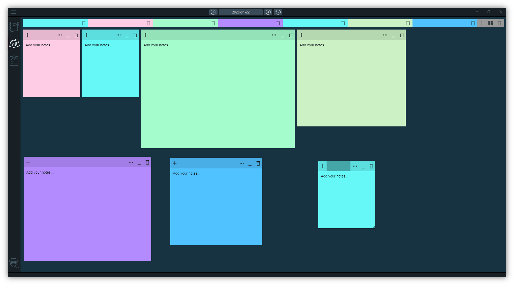
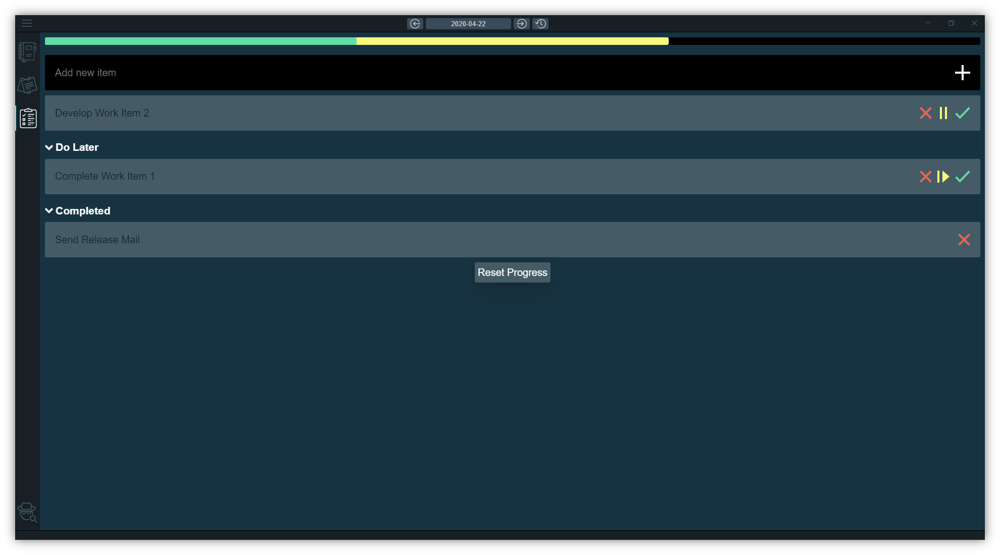

# Flawesome
Flawesome is a modern productivity tool that will help you organise your day-today work and thoughts.
<br>
All the three application components i.e. The Notebook, The Sticky Notes and The Todolist are driven by the Calendar. This makes it more like a digital diary with some additional features.






# Download

# [Flawesome v0.2.2 Pre-Release For Windows 64-Bit](https://github.com/ashishBharadwaj/flawesome/releases/download/0.2.2/Flawesome.Setup.0.2.2.exe)

# [Flawesome v0.2.2 Pre-Release For Linux (.deb)](https://github.com/ashishBharadwaj/flawesome/releases/download/0.2.2/flawesome_amd64_0.2.2.deb)

# [Flawesome v0.2.2 Pre-Release For Linux (.AppImage)](https://github.com/ashishBharadwaj/flawesome/releases/download/0.2.2/Flawesome-0.2.2.AppImage)

Go to [**Releases**](https://github.com/ashishBharadwaj/flawesome/releases) to see all the releases.

**Currently I have only generated the package for Windows, but soon it will be available for macos and linux aswell.**

# Build the setup yourself:

    ** Prequisite: Git, Node, Yarn package manager

- Clone the repo:

```bash
$ git clone https://github.com/ashishBharadwaj/flawesome.git
```

- Install the dependencies:

```bash
$ yarn install
```

- Build for production:

```bash
$ yarn build
```

- Create Package:

```bash
$ yarn package
```

## License
    MIT Copyright (c) 2020 Ashish Bharadwaj J
    Refer to License.md file for details

## Like my work ? Want to support ?
<a href='https://ko-fi.com/Y8Y01N1WE' target='_blank'></a>
