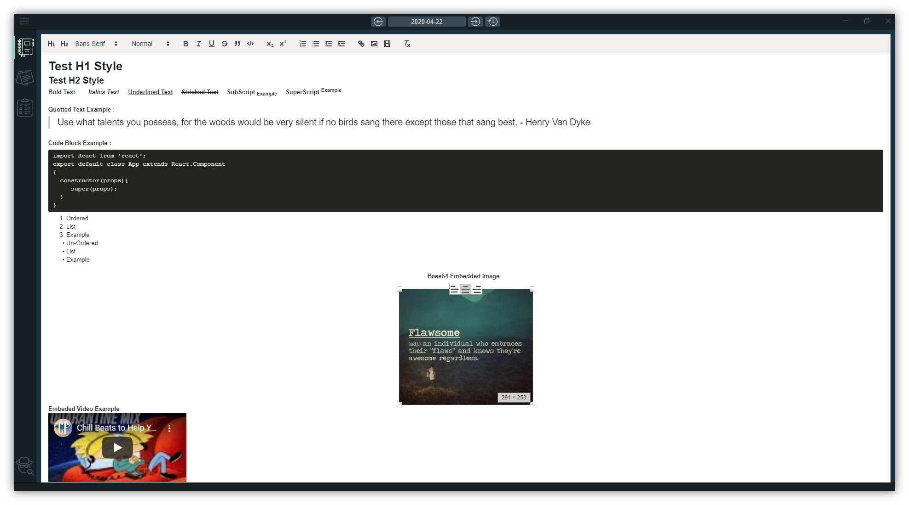
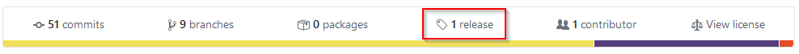

# Flawesome
Flawesome is a modern productivity tool that will help you organise your day-today work and thoughts.
All the three application components i.e. The Notebook, The Sticky Notes and The Todolist are driven by the Calendar.

# Built Using 
    react & electron

# Download
    Go to release and download the latest application setup

** Currently I have only generated the package for Windows, but soon it will be available for macos and linux aswell. **

## License
    MIT Copyright (c) 2020 Ashish Bharadwaj J
    Refer to License.md file for details